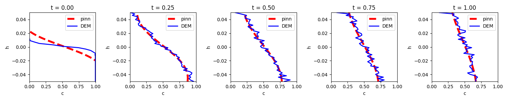

## Introduction <a name="intro"></a>

PINN is trained to find the diffusion coefficient from the evolving DEM simulation results.
The neural network loss funciton is custimized to include a 2D advection-diffusion equation: 

<p align="center">
  <br>
</p>


$$\frac{\partial c_i}{\partial t} -\frac{\partial}{\partial z} \Big( D\frac{\partial c_i}{\partial z} \Big)=0,$$

with the following boundary conditions:
$$c_i(t=0, z) = 0.5$$
$$w_{i}c_i|_{(t, z=0)}-D\frac{\partial c_i}{\partial z} |_{(t, z=H)} =0$$
$$w_{i}c_i|_{(t, z=0)}-D\frac{\partial c_i}{\partial z} |_{(t, z=H)}=0$$  

The objective is to extract the diffusion coefficient from the noisy sparse DEM simulation measurement.


$C_d$ is found to be 0.04, which is close to the range 0.3-0.5 reported in the literature.

## To use
1. Install the required dependencies:
```bash
pip install -r requirements.txt
```
2. Modify parameters as needed in the config.yaml file.
3. To start training, run the following command:
```bash
python train.py --train new
```


<!-- ## Results



## Papers related to PINN

[Causality PINN](https://arxiv.org/pdf/2203.07404): account for physical causality -->