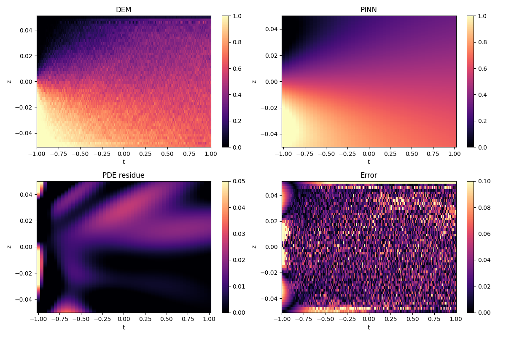

## Introduction 

PINN is trained to find the diffusion coefficient from the evolving DEM simulation results.
The neural network loss funciton is custimized to include a 2D advection-diffusion equation: 

$$\frac{\partial c_i}{\partial t} -\frac{\partial}{\partial z} \Big( D\frac{\partial c_i}{\partial z} \Big)=0,$$

with the following boundary conditions:
$$
  \begin{cases}
    c_i(t=0, z) = 0.5  \\ 
    w_{i}c_i|_{(t, z=0)}-D\frac{\partial c_i}{\partial z} |_{(t, z=H)} =0\\
    w_{i}c_i|_{(t, z=0)}-D\frac{\partial c_i}{\partial z} |_{(t, z=H)}=0\\
  \end{cases}
$$  

The objective is to extract the diffusion coefficient from the noisy sparse DEM simulation measurement.

## Results

## Papers related to PINN

[Causality PINN](https://arxiv.org/pdf/2203.07404): account for physical causality